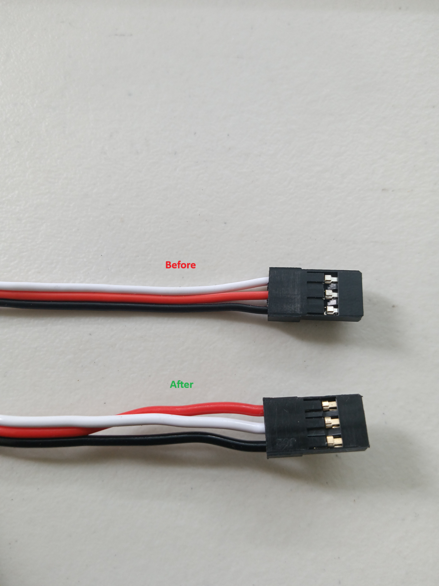
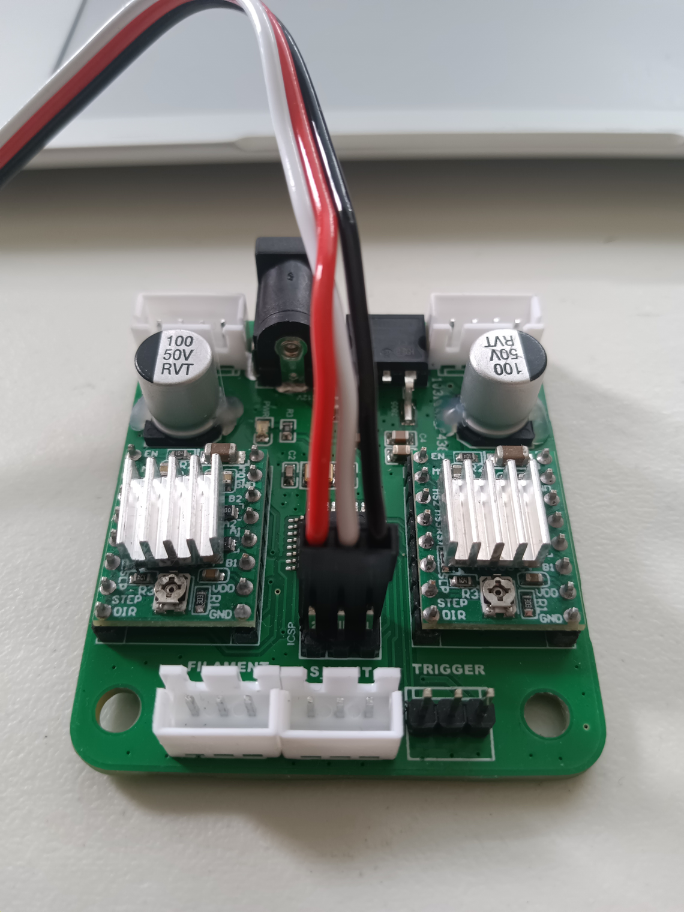

# Auto 3DClippy Filament Cutter

## Parts

Here are the Amazon links for the necessary parts  
(Only the M3x10 screws, super glue and 20kg servo are not included in the 3DChameleon Kit)

- [Utility Knife (1x)](https://www.amazon.com/gp/product/B07DXTP9M9)

- [20kg Servo (1x)](https://www.amazon.com/Torque-Motors-Waterproof-Steering-Control/dp/B073F92G2S)

- [M3 x 10mm Allen Head (4x)](https://www.amazon.com/Socket-Screws-Bolts-Thread-100pcs)

- [Loc-Tite Super Glue Gel (1x)](https://www.amazon.com/Loctite-1364076-Super-Squeeze-Liquid/dp/B0006HUJCQ)

- [PC4-M10 PTFE Connector (2x)](https://www.amazon.com/BIQU-Straight-Pneumatic-Connector-Extruder/dp/B01IB81IHG)
  
The servo uses standard servo motors and wires, however, the V+ and signal wire on the servo connected need to be reversed.  The servo wire will plug directly into the ICSP header on the 3DChameleon's electronics as shown here  

And you need to plug them into the ICSP header here:  

## Notes

> Note, in order to use the plastic control horn in our 3DClippy design, you'll want use the 4 way plastic control horn and cut off 3 of the arms.  This will fit directly onto the servo shaft and allow the blade holder to move in and out of the cutter.  

> Also note, you'll want to power on the 3DChameleon with the servo attached... cycle it by loading/unloading filaments a few times to make sure the servo ends in the correct "blade out" position before you attach the control horn.  
That way no calibration is needed.  
Also make sure you use the provided knife blades and glue them into place all the way into the blade holder.

## Extra

Printable files for both of these can be found on Tinkercad.  Just search for 3DClippy or 3DChameleon.  
Link to [Bils Tinkercad](https://www.tinkercad.com/users/6e03yb69x1J-wjsteele)  
Link to [3dclippy search on Tinkercad](https://www.tinkercad.com/search?q=3dclippy&staffPicks=0)
