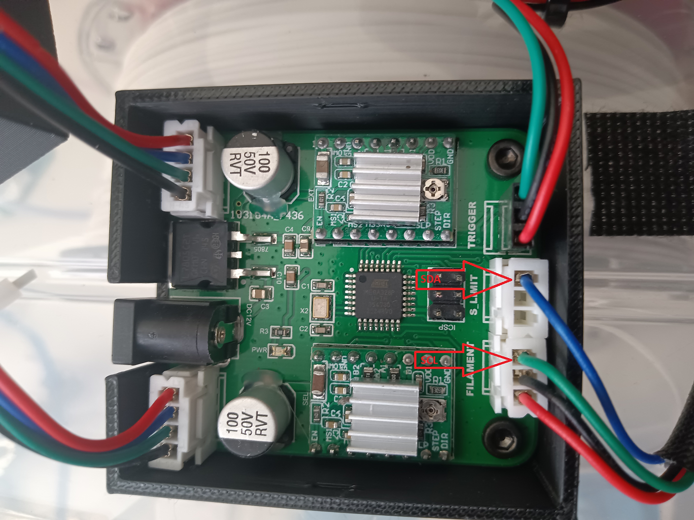

# OLED Install

- [OLED Install](#oled-install)
  - [Update](#update)
  - [Firmware](#firmware)
  - [The OLED Display info](#the-oled-display-info)
  - [Parts](#parts)
  - [Connectors](#connectors)

## Update  

Two updates are included (plus a lot of under the cover stuff) that will allow you to.  

- [1] add an OLED display to your 3DChameleon.  
- [2] Add the Auto 3DClippy filament cutter to your printer.

## Firmware

Let's start with the firmware.  Our Firmware Update thread has been updated to include the new Mk4.0 Firmware.  This firmware will be installed exactly as the previous ones, however, there is one additional step you need to take BEFORE you install it... and that is to burn the new bootloader from the latest version of the Arduino IDE to your board before you install the firmware.  Once you do that, you'll follow the exact same instructions as previously.  If you fail to do this step, you'll find that your unit responds very slowly.  If that's the case, you just need to redo it and make sure you burn the new Bootloader firmware FIRST.

## The OLED Display info

You can use any 4 pin OLED display that supports the 1306 interface. This is an I2C interface and requires two wires for the I2C Bus (SDA and SCL) as well as power and ground.

## Parts

You can find the required components to hook it up here on Amazon:

[OLED Display (1x)](https://www.amazon.com/UCTRONICS-SSD1306-Self-Luminous-Display-Raspberry/dp/B072Q2X2LL)

[Jumper Wires (4x)](https://www.amazon.com/Elegoo-EL-CP-004-Multicolored-Breadboard-arduino/dp/B01EV70C78)

[Molex cable Kit precrimped](https://www.amazon.com.au/Connector-pre-crimped-Housing-Adapter-Compatible/dp/B08G18PWQ6)

## Connectors

To connect it, you'll want to use 2x3 pin Molex KK connectors.  
Here's a picture of the wiring.
Blue is the SDA line.  
Green is the SCL line.  
Red is the V+  
Black is the Ground.  

<!-- [OLED Display]() -->

Once connected, powering on the 3DChameleon should display the 3DChameleon text.

The OLED display can be snap fit into the plastic cover provided on Tinkercad, or you can use it as a model to design your own. 
Link to [Bils Tinkercad](https://www.tinkercad.com/users/6e03yb69x1J-wjsteele)  
